## 👤 Profil Mahasiswa

| Atribut         | Keterangan          |
| --------------- | ------------------- |
| **Nama**        | Alvin Alfandy       |
| **NIM**         | 312310473           |
| **Kelas**       | TI.23.A.5           |
| **Mata Kuliah** | Pemrograman Website |

# Kuliner Nusantara - Website Kuliner Tradisional Indonesia

Selamat datang di repositori Kuliner Nusantara! Proyek ini adalah sebuah website yang menampilkan kekayaan kuliner tradisional Indonesia dengan gaya desain terinspirasi dari Netflix. Website ini dibangun menggunakan PHP dan MySQL untuk backend, serta HTML, CSS, dan JavaScript untuk frontend.

## Struktur Proyek

Berikut adalah penjelasan detail untuk setiap halaman utama dalam proyek ini:

### 1. Halaman Utama

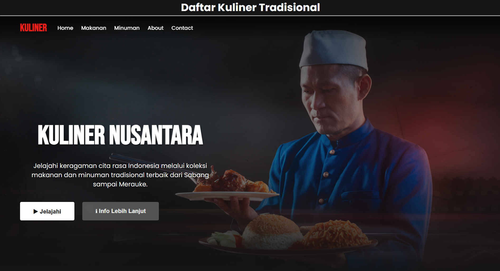
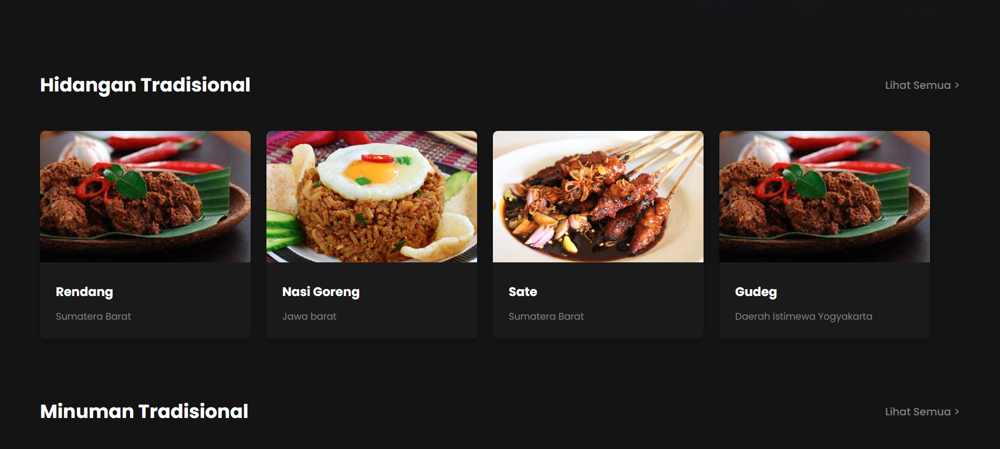
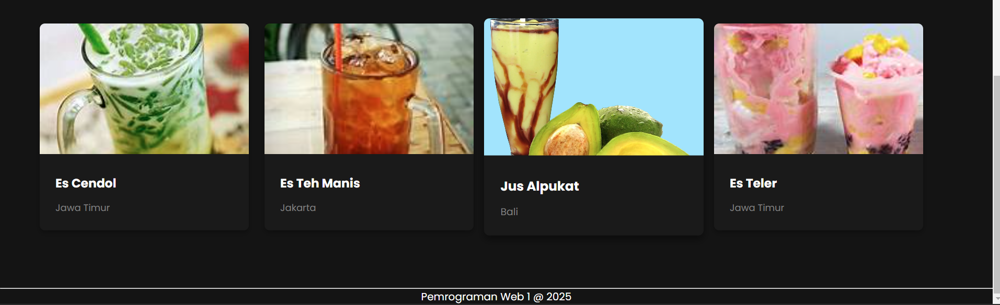

Halaman utama website menampilkan tampilan yang menarik dengan gaya Netflix, termasuk:

- **Hero Section**:

  - Menggunakan gambar latar belakang makanan Indonesia
  - Gradient overlay untuk meningkatkan keterbacaan teks
  - Judul utama menggunakan font 'Bebas Neue' dengan ukuran besar (5rem)
  - Deskripsi singkat dengan bayangan teks untuk kontras

- **Bagian "Trending"**:

  - Menampilkan makanan populer dalam format slider
  - Menggunakan badge dengan warna Netflix merah

- **Slider Konten**:

  - Untuk makanan dan minuman tradisional
  - Menggunakan `overflow-x: auto` dengan scrollbar tersembunyi
  - Efek hover pada kartu konten (scale dan box-shadow)

- **Grid Kategori**:
  - Menampilkan berbagai kategori kuliner dalam format grid responsif

Fitur CSS utama:

- Penggunaan variabel CSS untuk konsistensi warna
- Flexbox dan Grid untuk layout
- Media queries untuk responsivitas
- Animasi hover menggunakan transition

### 2. Halaman About Me

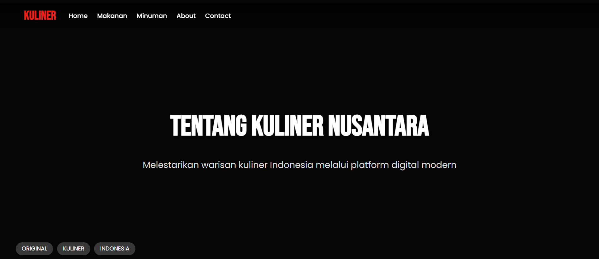
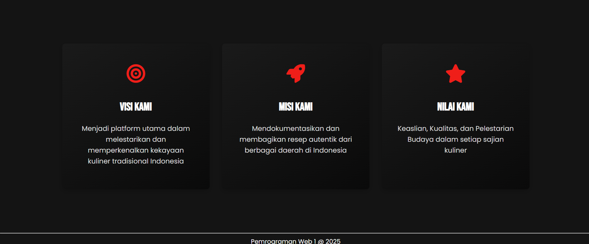

Halaman ini memberikan informasi tentang Kuliner Nusantara, dengan fitur:

- **Hero Section**:

  - Background image dengan overlay gradient
  - Judul besar menggunakan font 'Bebas Neue'
  - Tag-tag Netflix-style di bagian bawah

- **Konten Informatif**:
  - Menggunakan grid untuk layout responsif
  - Kartu fitur dengan ikon dan efek hover

Fitur CSS utama:

- Penggunaan flexbox untuk centering konten
- Box-shadow untuk efek elevasi pada kartu
- Transisi smooth pada hover efek

### 3. Halaman Kontak

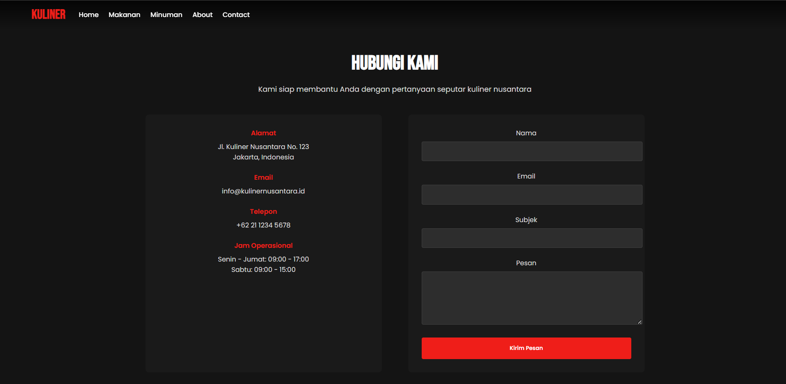

Halaman kontak menyediakan cara bagi pengunjung untuk menghubungi tim Kuliner Nusantara:

- **Form Kontak**:

  - Input fields dengan styling konsisten
  - Validasi form menggunakan HTML5 dan JavaScript
  - Tombol submit dengan efek hover

- **Informasi Kontak**:
  - Layout grid untuk menampilkan berbagai informasi kontak
  - Ikon untuk visualisasi informasi

Fitur CSS utama:

- Custom styling untuk form elements
- Penggunaan `:focus` pseudo-class untuk meningkatkan aksesibilitas
- Responsivitas menggunakan media queries

### 4. Halaman Daftar Makanan dan Minuman

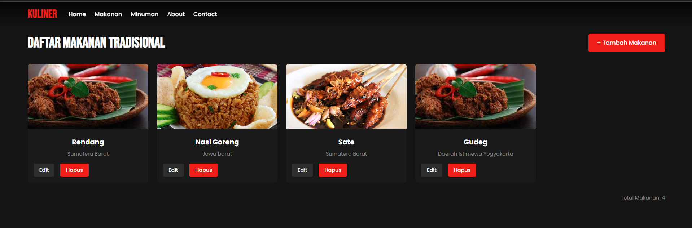
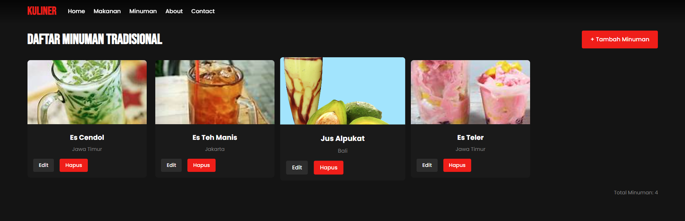

Menampilkan daftar makanan dan minuman tradisional dari database:

- **Grid Layout**:

  - Menggunakan CSS Grid dengan auto-fill untuk layout responsif
  - Gap antara item grid untuk spacing yang konsisten

- **Kartu Konten**:

  - Efek hover dengan transformasi scale dan box-shadow
  - Gambar dengan `object-fit: cover` untuk konsistensi tampilan

- **Tombol Aksi**:
  - Styling konsisten untuk tombol edit dan hapus
  - Efek hover untuk feedback visual

Fitur CSS utama:

- Grid template columns dengan minmax untuk responsivitas
- Transition pada hover effects untuk animasi smooth
- Penggunaan variabel CSS untuk konsistensi warna

### 5. Halaman Tambah dan Edit

## Halaman Tambah

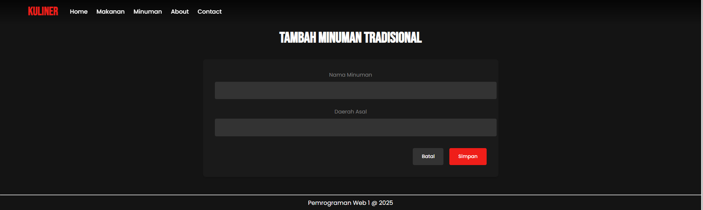

## Halaman edit/update

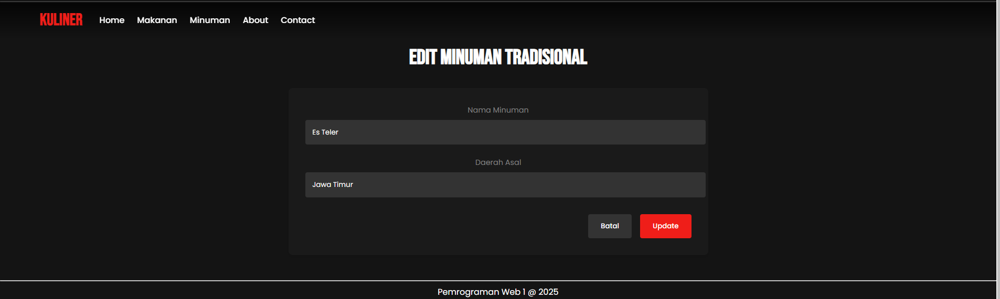

Form untuk menambahkan atau mengedit data makanan dan minuman:

- **Form Layout**:

  - Struktur form yang konsisten dengan styling Netflix
  - Label dan input yang jelas dan mudah dibaca

- **Validasi Form**:

  - Menggunakan atribut HTML5 seperti required
  - Custom validasi JavaScript

- **Tombol Aksi**:
  - Styling konsisten dengan halaman lain
  - Penempatan yang intuitif (cancel di kiri, submit di kanan)

Fitur CSS utama:

- Custom styling untuk form inputs
- Penggunaan `:focus` pseudo-class untuk accessibility
- Flexbox untuk layout tombol

### 6. Halaman 404 (404.php)

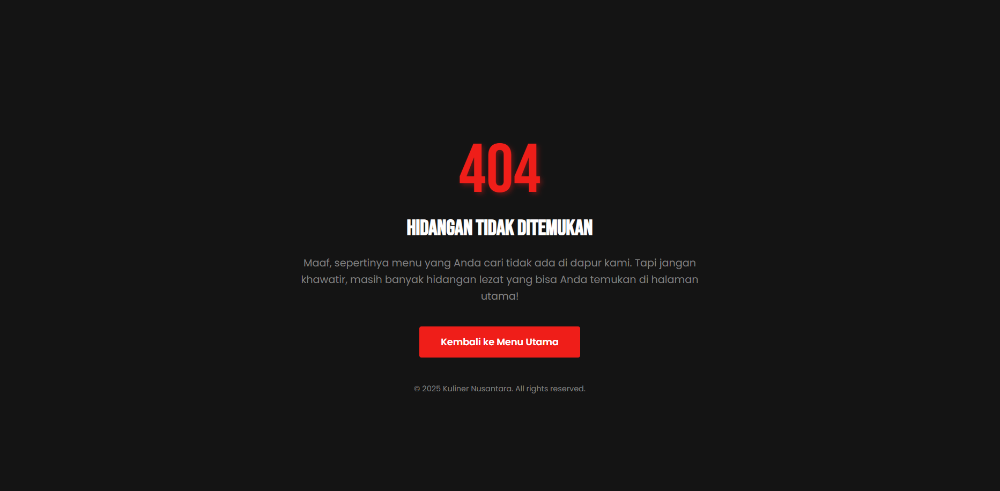

Halaman error custom dengan tema Kuliner Nusantara:

- **Layout Sentris**:

  - Menggunakan flexbox untuk centering konten vertikal dan horizontal

- **Tipografi Menarik**:

  - Kode error besar dengan efek bayangan teks
  - Judul dan pesan error yang ramah pengguna

- **Gambar Tematik**:

  - Gambar makanan Indonesia yang ditampilkan dalam bentuk lingkaran
  - Menggunakan box-shadow untuk efek elevasi

- **Tombol Kembali**:
  - Styling konsisten dengan tema Netflix
  - Efek hover untuk feedback interaktif

Fitur CSS utama:

- Penggunaan flexbox untuk layout sentris
- Text-shadow untuk efek visual pada teks
- Border-radius dan box-shadow untuk styling gambar
- Media queries untuk responsivitas pada perangkat mobile

## Teknologi yang Digunakan

- PHP 7.4+
- MySQL 5.7+
- HTML5
- CSS3 (dengan variabel CSS untuk tema)
- JavaScript (ES6+)
- Font Awesome untuk ikon
- Google Fonts (Bebas Neue dan Poppins)
